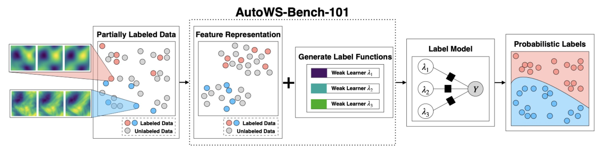
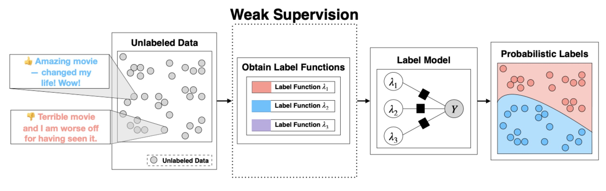

It is no secret that large-scale supervised machine learning is expensive and that one of the biggest challenges is in obtaining the labeled data required for training machine learning  models. 
Weak Supervision (WS) a popular and quite successful technique for reducing this need for labeled data. 
WS relies on access to noisy, heuristic functions that produce reasonable label guesses--these are called labeling functions, or LFs for short. 
Given a handful of these LFs, WS attempts to learn the relationships between the LFs and the true but *unobserved* label--the component that does this is called the Label Model. 
WS is fairly easy to apply to text data, it's harder to apply to data with more complex features. 
Automated Weak Supervision (AutoWS) solves this problem by instead *learning* the LFs using a small amount of labeled data. 
In this blog post, we will shed some light on AutoWS and explain the motivation behind our AutoWS-Bench-101 benchmark, the first-ever benchmark for AutoWS!

# Weak Supervision by example: Rotten Tomatoes


Let's step through a quick example of WS on movie review data... 
Here, the goal is to classify Rotten Tomatoes reviews as either "Fresh (+)" or "Rotten (-)"
Suppose we start off with three LFs, and for simplicity, we will use majority voting as our Label Model:
  1. LF1 returns "Fresh" if the movie review contains the word "amazing," otherwise don't vote,
  2. LF2 returns "Rotten" if the movie review contains the word "nightmare," otherwise don't vote, and
  3. LF3 returns "Fresh" or "Rotten" depending on the prediction of an off-the-shelf sentiment classifier. 

Now let's apply these LFs to the following review of the 2019 movie Cats:
```
"At best, it’s an ambitious misfire. At worst, it’s straight-up nightmare fuel that will haunt generations. Enter into the world of the Jellicles at your own peril."
```
Most people would probably assign this review the label "Rotten," though since we're doing WS, let's check to see if our LFs agree... 
LF1 doesn't vote because the word "amazing" does not appear in the text, LF2 votes "Rotten," and for the sake of argument, suppose that LF3 also votes "Rotten." 
Since we're aggregating these LF outputs using majority vote, WS correctly labels this review as "Rotten." 

The purpose of this example was twofold: first, if you aren't familiar with WS, this example was hopefully illuminating, and second, that *it's easy to write LFs for text data!* 
The "features" that come with text (i.e., words) are more intuitive for humans to reason about, which makes it easier to come up with fairly general rules for text tasks. 

But what about data with more complex features, such as images? 
To our knowledge, traditional WS hasn't even been applied to MNIST, because writing LFs from scratch for raw pixel data is simply not practical. 

# From WS to AutoWS


# ...Key, common components of AutoWS methods
# ...Types of data for which AutoWS is the most promising 
# ...A direct comparison between these different methods 

